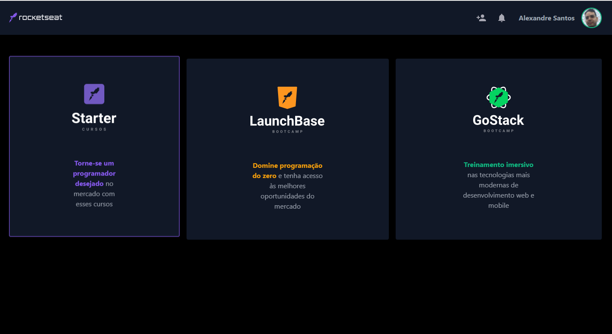

## Clone do dashboard da Rocketseat utilizando TailwindCSS

Olá, esse pequeno projeto desenvolvido apenas utilizando HTML5, o framework TailwindCSS e um pouco de JavaScript.

## Primeiros passos 🏁

clone o repositório.

```sh
git clone https://github.com/alexandresantosm/clone-dasboard-rocketseat.git
```

`cd` no diretório.

```sh
cd clone-dasboard-rocketseat
```

## Ferramentas 🧰

- [x] HTML5
- [x] JavaScript
- [x] [TailwindCSS](https://tailwindcss.com/)

## Estrutura do Projeto 🏗

Na pasta `src`, temos:

- `index.html`: arquivo da página (Estrutura e estilização utilizando TailwindCSS).
- `tailwind.config.js`: arquivo de configuração do TailwindCSS.

## Expert

| [](https://github.com/alexandresantosm) |
| :--------------------------------------------------------------------------------------------------------------------: |
|                                [Alexandre Santos](https://github.com/alexandresantosm)                                 |

## Licença

Projetado com ❤️ por [Alexandre Santos](https://github.com/alexandresantosm). Licenciado sob a [Licença MIT](LICENSE.md).
